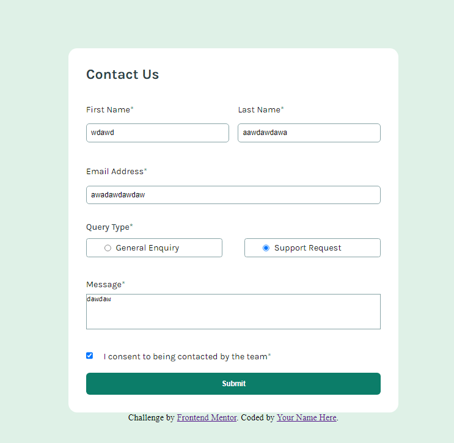

# Frontend Mentor - Contact form solution
##Preview project

## Table of contents

- [Overview](#overview)
  - [The challenge](#the-challenge)
  - [Links](#links)
  - [Built with](#built-with)
  - [Continued development](#continued-development)
- [Author](#author)

## Overview
el proyecto es un form que cuando no rellenas un input le sale un mensaje de error abajo del input, y si todos los inputs estan rellenados sale un mensaje de que se envio el from.
### The challenge

Users should be able to:

- Complete the form and see a success toast message upon successful submission
- Receive form validation messages if:
  - A required field has been missed
  - The email address is not formatted correctly
- Complete the form only using their keyboard
- Have inputs, error messages, and the success message announced on their screen reader
- View the optimal layout for the interface depending on their device's screen size
- See hover and focus states for all interactive elements on the page

### Links

- Solution URL: [solution github](https://github.com/feimb/Contact-form-FrontendMentor)
- Live Site URL: [solution web](https://feimb.github.io/Contact-form-FrontendMentor/)

### Built with

- Semantic HTML5 markup
- CSS custom properties
- Flexbox
- CSS Grid
- Javascript

### Continued development

Mainly I should focus on the form sending information somewhere, because currently I don't know how to send that information and do something with it.

## Author

- Website - [Fei Mosqueda]([https://www.your-site.com](https://feimb.github.io/portafolio_web/))
- Frontend Mentor - [@Feimb](https://www.frontendmentor.io/profile/feimb)
- linkedin - [@Feimb](https://www.linkedin.com/in/fei-mosqueda-934036260/)

